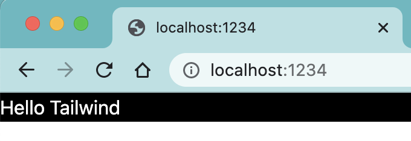

# intro-to-tailwind

> Playing with [Tailwind](https://tailwindcss.com/)

## Installation

```
npm install -D tailwindcss
npx tailwindcss init
```

Added parallel watch mode, Parcel bundler.

## Run

```
npm start
```

Open the browser at `localhost:1234`

## Look

### Step1



Check out tag "step-1" for the code

### Step2

Added avatar, paragraphs, hover background


Check out tag "step-2"
